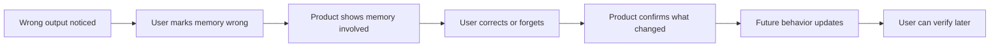

# Correction Loop Diagram

## Purpose

Show the minimum loop required for a trustworthy memory correction experience.

## When to use

Use this when reviewing how users fix wrong memory from an output, recommendation, or automation.

## Diagram

## How product teams should apply it

Test the correction loop with a realistic wrong-memory scenario. If the user cannot verify the change, the loop is incomplete.

## Common mistakes

- Offering feedback without changing memory.
- Hiding which memory caused the mistake.
- Failing to explain scope of correction.
- Correcting future behavior but leaving the current output unexplained.
