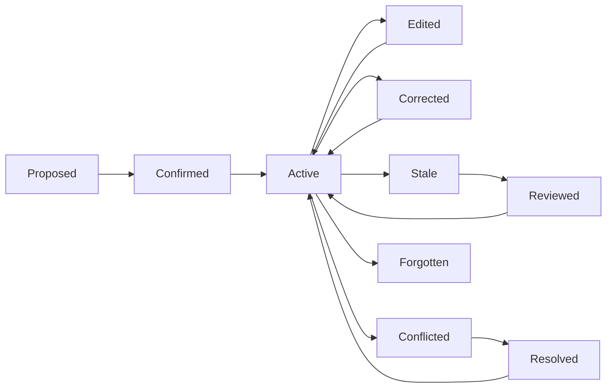

# Memory Lifecycle Diagram

## Purpose

Show how a memory moves from proposal to active use, correction, staleness, conflict, and forgetting.

## When to use

Use this when a team is designing a new memory feature or auditing whether a memory type has a complete lifecycle.

## Diagram

## How product teams should apply it

Map each memory object to every lifecycle state. If a state has no user control, decide whether the gap is acceptable for the risk level.

## Common mistakes

- Designing capture without designing correction.
- Treating deletion and archive as the same state.
- Forgetting stale review triggers.
- Failing to show users when memory becomes active.
